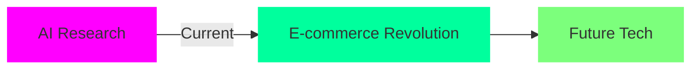

<div align="center">


# ⚡ EKLAVYA SINGH ⚡

[](https://git.io/typing-svg)

<a href="https://github.com/eklavyabytesquad">
    
</a>


</div>

## 🤖 Neural Network (About Me)
```python
class TechInnovator:
    def __init__(self):
        self.name = "Eklavya Singh"
        self.role = "Full Stack Architect"
        self.base_location = "Chennai, India"
        self.education = "IIT Madras"
        self.code = {
            "purpose": "Building the future, one commit at a time",
            "mission": "Bridging human creativity with AI capabilities"
        }
        
    def current_ventures(self):
        return {
            "organization": "Software Development Engineer @ Miniture",
            "project": "Revolutionizing E-commerce with AI",
            "research": ["Neural Networks", "System Architecture", "Edge Computing"],
            "learning": "Advanced AI/ML, Cloud Native DevOps, Quantum Computing"
        }
    
    def superpower(self):
        return "Transforming complex problems into elegant solutions"

innovator = TechInnovator()
print(f"Mission: {innovator.code['mission']}")
```

## 🌐 Tech Arsenal

<div align="center">

<details>
<summary>🔋 Frontend Matrix</summary>
<br>

[](#) 
[](#) 
[](#) 
[](#)

</details>

<details>
<summary>🔮 Style Forge</summary>
<br>

[](#)
[](#)
[](#)
[](#)

</details>

<details>
<summary>⚡ Backend Cortex</summary>
<br>

[](#)
[](#)
[](#)
[](#)

</details>

<details>
<summary>🛠 Neural Tools</summary>
<br>

[](#)
[](#)
[](#)
[](#)

</details>

</div>

## 📊 Neural Activity Metrics

<div align="center">

<!-- GitHub Stats Card with Enhanced Colors -->


<!-- Most Used Languages Card -->


<!-- GitHub Streak Stats -->


</div>

## 🎯 Innovation Timeline
<div align="center">



</div>

- 🧬 Pioneering AI-driven solutions in E-commerce ecosystem
- 🔮 Building next-gen applications with cutting-edge tech stack
- 🎓 Researching advanced ML algorithms at IIT Madras
- 💡 Developed AI-powered recommendation systems
- 🚀 Led technical architecture for enterprise solutions
- 🌟 Created autonomous deployment pipelines
- 🔑 Expertise in scalable microservices architecture

## 🌠 Digital Nexus

<div align="center">

[](https://linkedin.com/in/eklavyasinghweb)
[](https://eklavyadev.com)
[](https://github.com/eklavyabytesquad)


</div>

## 🎖️ Achievement Matrix

<div align="center">

[](https://holopin.io/@eklavyabytesquad)


</div>


<div align="center">


</div>
